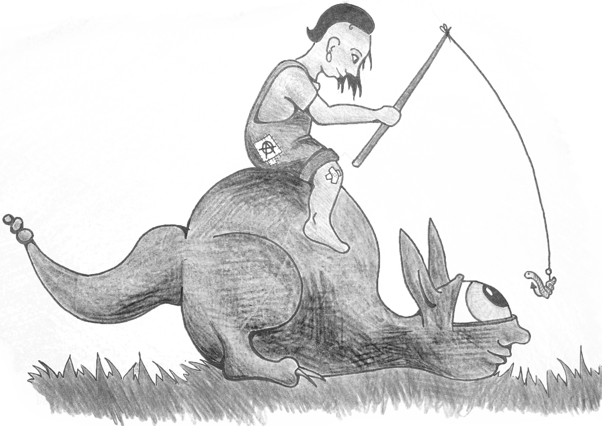

# 3.1.2. Erzwingungshaft

[//]: # (3.1.2.-Erzwingungshaft)
[//]: # (files/2019/05/3.1.2.-Erzwingungshaft.png)
  
Wenn eure Darlegung der Mittellosigkeit vom Gericht ignoriert wurde oder ihr die Darlegung verpennt habt, kriegt ihr irgendwann Post von der Bußgeldbehörde in der der Haftantrittstermin, die Justizvollzugsanstalt an der das stattfinden soll und praktischerweise auch die Dauer des ganzen Theaters mit drinnen steht. Ihr wisst also von Anfang an, wie lange ihr drinnen sein werdet und wann und wo das stattfindet. Für die Dauer der Erzwingungshaft gibt es – abgesehen von der Generalklausel der Verhältnismäßigkeit – keine gesetzlichen Regeln. Üblich sind aber für je 20 bis 50 € 1 Tag Haft anzuordnen. Falls euch aber die Haft doch zu lange ist, könnt ihr an jedem Punkt das Bußgeld bezahlen und das ganze Theater mit Erzwingungshaft hat ein Ende (§ 97 (2) OWiG). Sie haben euch ja erfolgreich zur Zahlung gezwungen, wodurch kein Haftgrund mehr besteht. Dabei müsst ihr immer das gesamte Bußgeld bezahlen, ganz egal wie viele Tage ihr schon eingesperrt wart. Es gibt bei Ordnungswidrigkeiten keine Möglichkeit nach der Hälfte zu gehen und die Hälfte der Strafe zu zahlen! Die Maximaldauer für Erzwingungshaft beträgt 6 Wochen wegen eines Bußgeldes und 3 Monate wegen mehrerer Bußgelder (§ 96 (3) OWiG) wird aber unserer Erfahrung nach nicht annäherungsweise ausgeschöpft (kann aber auch mal anders kommen).  
Am Schluss noch der Hinweis, dass natürlich die Verfahrenskosten steigen wenn ihr euch von der Bußgeldbehörde mit Post zumüllen und einsperren lasst. Verfahrenskosten werden wie zivilrechtliche Forderungen vollstreckt und eins sollte sich auch einen Umgang mit diesen Forderungen überlegen (beispielsweise den Staat auf den Kosten sitzen lassen).

[zurück](3-1-1-zahlungsunfaehigkeit-2.md)

[weiter](3-2-tagessaetze-3.md)
